<div align="center">

# storylabs-charts

**Gráficos en SVG y CSS hechos a mano.**<br>
Sin dependencias, sin framework y en menos de 18 KB.

<picture>
  <source media="(prefers-color-scheme: dark)" srcset="docs/img/hero-dark.png">
  <source media="(prefers-color-scheme: light)" srcset="docs/img/hero-light.png">
  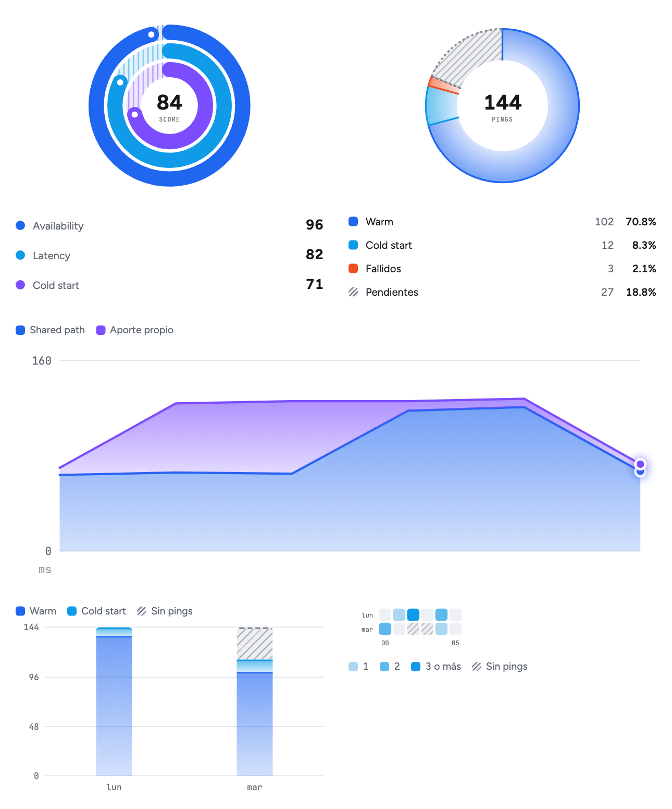
</picture>

</div>

## Qué es

Una librería de gráficos donde cada gráfico es **una función que devuelve HTML**. No hay
componentes, ni canvas, ni un objeto que configurar: le pasás datos y te devuelve un string.

| | |
|---|---|
| **Funciones puras** | Reciben opciones y devuelven un string. No tocan el DOM. |
| **Corre en cualquier lado** | Navegador, servidor, Vue, React o un template armado a mano. |
| **Liviana** | JS y CSS juntos pesan menos de 18 KB con gzip. Un test lo vigila. |
| **Tema por CSS** | Colores y rayado son variables CSS. Dark y light vienen incluidos. |
| **No se rompe** | Un dato malo dibuja un aviso en su lugar. Nunca tira abajo la página. |
| **No miente** | Un dato que falta se dibuja como faltante, no como un cero. |

## La gramática del rayado

Toda la librería usa el relleno para decir una sola cosa: **qué se midió y qué no.**

| Relleno | Significa |
|---|---|
| **Sólido** | Lo que se midió. |
| **Rayado** (hatched) | Lo que no es una medición: una referencia, un rango, una proyección o un dato que falta. |
| **Tinte** | La escala completa: el fondo de la barra. |

Un dato medido nunca va rayado.

<picture>
  <source media="(prefers-color-scheme: dark)" srcset="docs/img/bullet-dark.png">
  <source media="(prefers-color-scheme: light)" srcset="docs/img/bullet-light.png">
  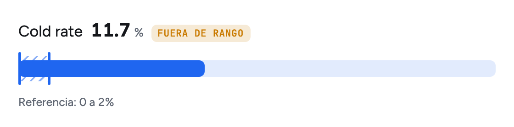
</picture>

## Empezar

```sh
bun add github:StoryLabs/chart
```

```js
import '@storylabs/charts/charts.css'
import { bullet, mount, render } from '@storylabs/charts'

mount()

render(
  document.getElementById('latencia'),
  bullet({ label: 'Warm p50', value: 69, unit: 'ms', max: 500, reference: [0, 250] })
)
```

Son tres piezas:

| Pieza | Qué hace |
|---|---|
| `bullet(…)` | Devuelve el HTML del gráfico. |
| `render(el, html)` | Lo pone en la página, y sólo si cambió. |
| `mount()` | Se llama una vez. Atiende tooltip, hover y leyendas de todos los gráficos, también de los que se pintan después. |

## Galería

| | | |
|:---:|:---:|:---:|
| [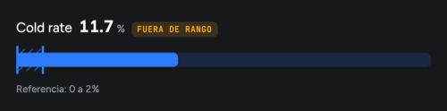](#bullet)<br>[`bullet()`](#bullet) | [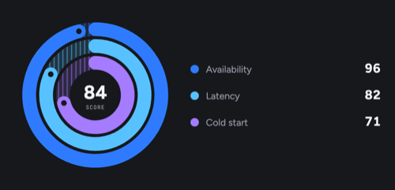](#rings)<br>[`rings()`](#rings) | [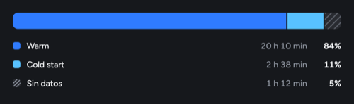](#segmented)<br>[`segmented()`](#segmented) |
| [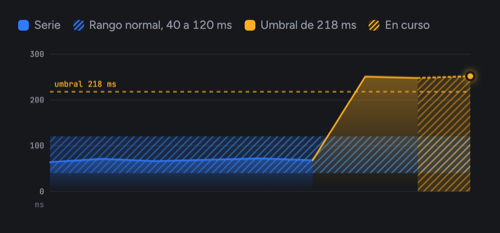](#line)<br>[`line()`](#line) | [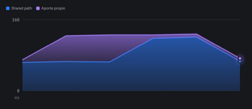](#stackedline)<br>[`stackedLine()`](#stackedline) | [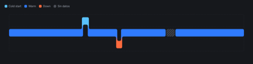](#ribbon)<br>[`ribbon()`](#ribbon) |
| [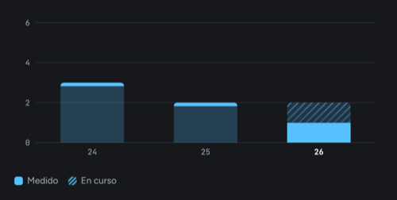](#columns)<br>[`columns()`](#columns) | [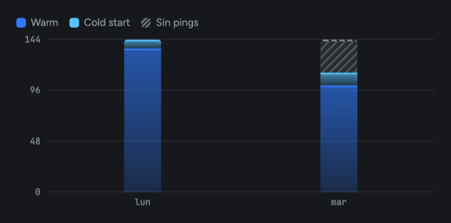](#stacked)<br>[`stacked()`](#stacked) | [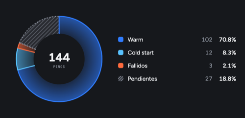](#pie)<br>[`pie()`](#pie) |
| [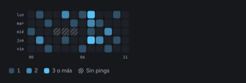](#heatmap)<br>[`heatmap()`](#heatmap) | [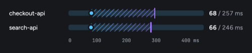](#range)<br>[`range()`](#range) | [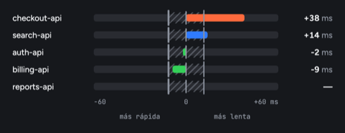](#diverging)<br>[`diverging()`](#diverging) |
| [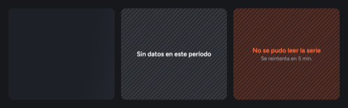](#estados)<br>[`state()`](#estados) | | |

## Dónde se usa

<details>
<summary><b>Sin bundler</b></summary>

Los módulos de `src/` son ES modules de verdad, con sus extensiones: el navegador los carga sin
compilar nada.

```html
<link rel="stylesheet" href="node_modules/@storylabs/charts/src/charts.css">
<div id="latencia"></div>

<script type="module">
  import { bullet, mount, render } from './node_modules/@storylabs/charts/src/index.js'

  mount()
  render(document.getElementById('latencia'), bullet({ label: 'Warm p50', value: 69, unit: 'ms', max: 500, reference: [0, 250] }))
</script>
```

Para un solo archivo con el global `StorylabsCharts`, cloná el repo y corré `bun run build`: deja
`dist/storylabs-charts.iife.js` y `dist/charts.css`.

</details>

<details>
<summary><b>En el servidor</b></summary>

El string va directo al template. No hace falta un DOM.

```js
import { line } from '@storylabs/charts/line'

const html = `<section>${line({ values: [10, 20, 15, 30], max: 40 })}</section>`
```

En el cliente, una vez cargada la página:

```js
import { mount, setHatch } from '@storylabs/charts/runtime'

mount()
setHatch()
```

</details>

<details>
<summary><b>En Vue</b></summary>

```vue
<script setup>
import { onMounted, ref, watchEffect } from 'vue'
import { bullet, mount, render } from '@storylabs/charts'

const props = defineProps({ value: Number })
const el = ref(null)

onMounted(mount)
watchEffect(() => {
  if (el.value) render(el.value, bullet({ label: 'Warm p50', value: props.value, unit: 'ms', max: 500, reference: [0, 250] }))
})
</script>

<template>
  <div ref="el" />
</template>
```

</details>

<details>
<summary><b>En React</b></summary>

```jsx
import { useEffect, useRef } from 'react'
import { bullet, mount, render } from '@storylabs/charts'

export function Latencia({ value }) {
  const el = useRef(null)

  useEffect(mount, [])
  useEffect(() => {
    render(el.current, bullet({ label: 'Warm p50', value, unit: 'ms', max: 500, reference: [0, 250] }))
  }, [value])

  return <div ref={el} />
}
```

</details>

<details>
<summary><b>Un gráfico solo, para que pese menos</b></summary>

Cada gráfico tiene su propia entrada, y el runtime también.

```js
import { bullet } from '@storylabs/charts/bullet'
import { mount, render } from '@storylabs/charts/runtime'
```

</details>

## Los gráficos

Las opciones marcadas con ★ son obligatorias.

<a id="bullet"></a>

### `bullet()` · un valor contra su rango de referencia

<picture>
  <source media="(prefers-color-scheme: dark)" srcset="docs/img/bullet-dark.png">
  <source media="(prefers-color-scheme: light)" srcset="docs/img/bullet-light.png">
  
</picture>

```js
bullet({ label: 'Cold rate', value: 11.7, unit: '%', max: 30, reference: [0, 2] })
```

Si el valor cae fuera de la referencia, agrega solo el aviso «fuera de rango». Varios bullets
dentro de un `<div class="sc-group">` comparten el hover.

<details>
<summary>Opciones</summary>

| Opción | Tipo | Default |
|---|---|---|
| `label` ★ | string | |
| `value` ★ | number | |
| `max` ★ | number | La escala va de `min` a `max`. |
| `min` | number | `0`. Para que un valor alto se lea, como un uptime de 99.95 con `min: 99`. Lo que queda debajo se dibuja en `min`; el tooltip muestra el valor real. |
| `reference` ★ | `[desde, hasta]` | La banda rayada. |
| `unit` | string | `''` |
| `side` | string | Texto a la derecha. |
| `hue`, `hue2` | tono | `'blue'`, igual a `hue` |
| `key` | string | `label` |

</details>

<a id="rings"></a>

### `rings()` · anillos concéntricos

<picture>
  <source media="(prefers-color-scheme: dark)" srcset="docs/img/rings-dark.png">
  <source media="(prefers-color-scheme: light)" srcset="docs/img/rings-light.png">
  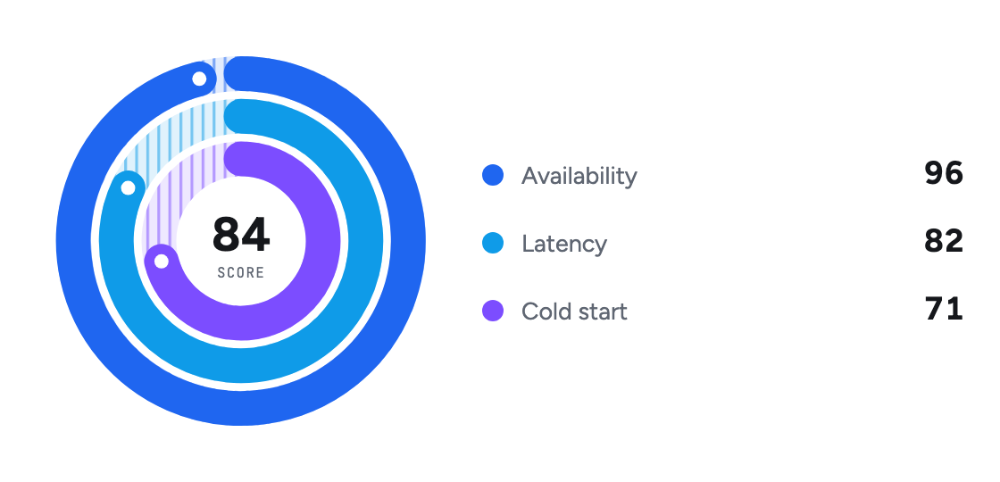
</picture>

```js
rings({
  center: { value: 84, label: 'score' },
  rings: [
    { key: 'availability', label: 'Availability', value: 96, hue: 'blue' },
    { key: 'latency', label: 'Latency', value: 82, hue: 'sky' },
    { key: 'coldstart', label: 'Cold start', value: 71, hue: 'violet' }
  ]
})
```

El tramo rayado de cada anillo es lo que falta para llegar al máximo.

<details>
<summary>Opciones</summary>

| Opción | Tipo | Default |
|---|---|---|
| `rings` ★ | `[{ key, label, value, max, hue }]` | `max` vale 100. Hasta 6 anillos: con 5 o 6 se hacen más finos para que entren y el centro se lea; con más, el estado de error. |
| `center` | `{ value, label }` | El número del medio. |

</details>

<a id="segmented"></a>

### `segmented()` · una barra partida

<picture>
  <source media="(prefers-color-scheme: dark)" srcset="docs/img/segmented-dark.png">
  <source media="(prefers-color-scheme: light)" srcset="docs/img/segmented-light.png">
  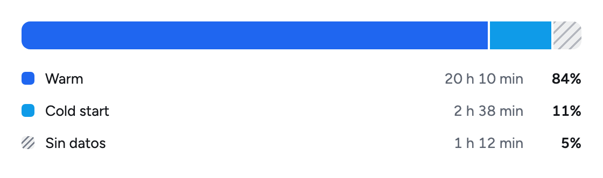
</picture>

```js
segmented({
  segments: [
    { key: 'warm', label: 'Warm', value: 84, detail: '20 h 10 min', hue: 'blue' },
    { key: 'cold', label: 'Cold start', value: 11, detail: '2 h 38 min', hue: 'sky' },
    { key: 'none', label: 'Sin datos', value: 5, detail: '1 h 12 min', hue: 'neutral', hatched: true }
  ]
})
```

Al apagar un tramo desde la leyenda, los demás se reparten el lugar.

<details>
<summary>Opciones</summary>

| Opción | Tipo |
|---|---|
| `segments` ★ | `[{ key, label, value, detail, hue, hatched }]` |

</details>

<a id="line"></a>

### `line()` · una serie en el tiempo

<picture>
  <source media="(prefers-color-scheme: dark)" srcset="docs/img/line-dark.png">
  <source media="(prefers-color-scheme: light)" srcset="docs/img/line-light.png">
  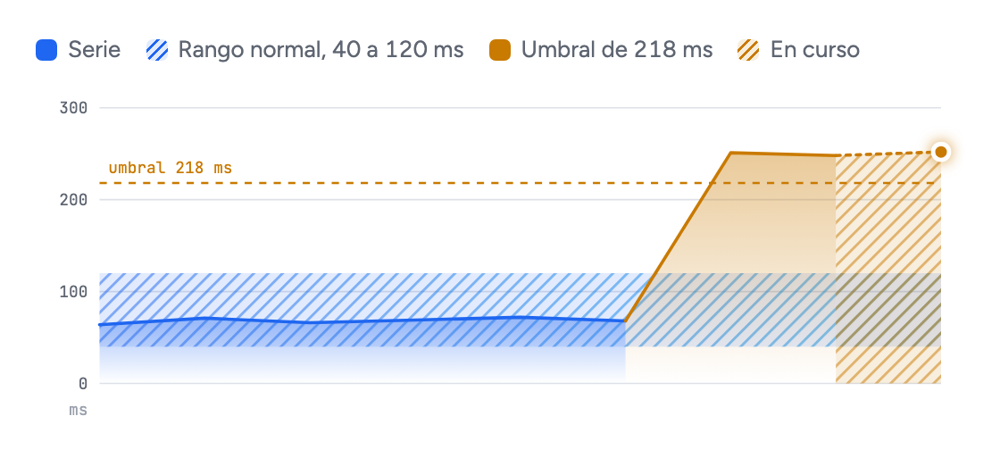
</picture>

```js
line({
  values: [64, 71, 66, 69, 72, 68, 251, 248, 252],
  unit: 'ms',
  max: 300,
  yTicks: [0, 100, 200, 300],
  band: [40, 120],
  threshold: { value: 218 },
  buffer: true
})
```

| Pieza | Qué es |
|---|---|
| Banda rayada | El rango normal. |
| Línea punteada | El umbral. Sobre él, la serie cambia de color. |
| Último tramo rayado | El `buffer`: el período que todavía está en curso. |
| Cursor | Muestra el valor del punto más cercano. |

Con más puntos que píxeles, se queda con el mínimo y el máximo de cada tramo. Los picos no se
pierden.

<details>
<summary>Opciones</summary>

| Opción | Tipo | Default |
|---|---|---|
| `values` ★ | number[] | |
| `max` ★ | number | |
| `labels` | string[] | El rótulo de cada punto, para el tooltip. |
| `yTicks` | number[] | `[0, max]` |
| `xLabels` | `[primero, último]` | |
| `band` | `[desde, hasta]` | |
| `threshold` | `{ value, label }` | |
| `buffer` | boolean | `false` |
| `bufferLabel` | string | `'En curso'` |
| `gaps` | `'hatched'` \| `'empty'` | `'hatched'`. Ver [datos que faltan](#datos-que-faltan). |
| `hue`, `hue2`, `alertHue` | tono | `'blue'`, `'sky'`, `'amber'` |
| `maxPoints` | number | `600` |
| `unit`, `label`, `headline` | | |

</details>

<a id="stackedline"></a>

### `stackedLine()` · líneas apiladas

<picture>
  <source media="(prefers-color-scheme: dark)" srcset="docs/img/stackedLine-dark.png">
  <source media="(prefers-color-scheme: light)" srcset="docs/img/stackedLine-light.png">
  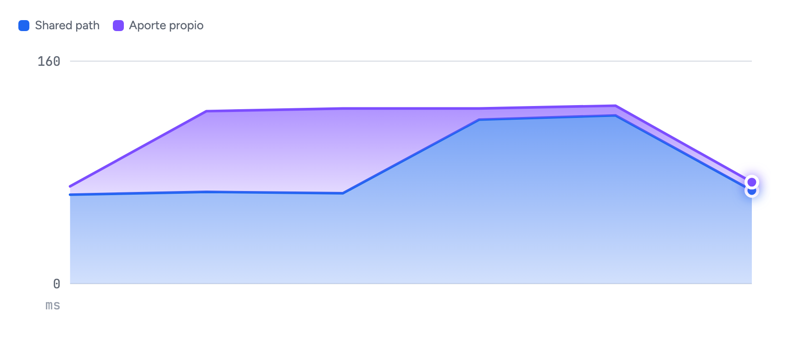
</picture>

```js
stackedLine({
  unit: 'ms',
  max: 160,
  totalLabel: 'TTFB',
  series: [
    { key: 'shared', label: 'Shared path', hue: 'blue', values: [64, 66, 65, 118, 121, 67] },
    { key: 'own', label: 'Aporte propio', hue: 'violet', values: [6, 58, 61, 8, 7, 6] }
  ]
})
```

Cada serie se dibuja encima de la suma de las anteriores: la línea de más arriba es el total. La
primera serie va abajo. Al apagar una desde la leyenda, las demás se vuelven a apilar.

<details>
<summary>Opciones</summary>

| Opción | Tipo | Default |
|---|---|---|
| `series` ★ | `[{ key, label, hue, values }]` | |
| `max` ★ | number | |
| `labels` | string[] | |
| `xTicks` | `[{ at, label }]` | |
| `yTicks` | number[] | `[0, max]` |
| `totalLabel` | string | `'Total'` |
| `buffer`, `bufferLabel` | | Como en `line()`. |
| `gaps` | `'hatched'` \| `'empty'` | `'hatched'` |
| `wide` | boolean | `false`. Para ocupar todo el ancho. |
| `hidden` | string[] | Las series apagadas. |
| `maxPoints` | number | `600`, o `1000` con `wide` |
| `unit`, `label`, `headline` | | |

</details>

<a id="ribbon"></a>

### `ribbon()` · estados en el tiempo

<picture>
  <source media="(prefers-color-scheme: dark)" srcset="docs/img/ribbon-dark.png">
  <source media="(prefers-color-scheme: light)" srcset="docs/img/ribbon-light.png">
  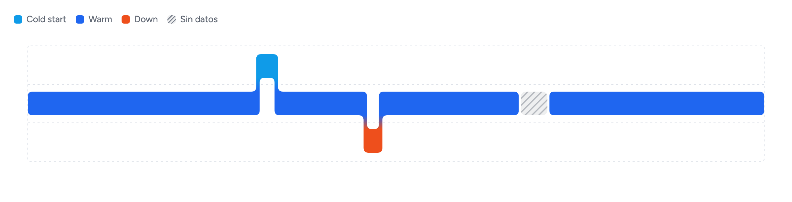
</picture>

```js
ribbon({
  rest: 'warm',
  states: {
    cold: { label: 'Cold start', hue: 'sky', lane: 0 },
    warm: { label: 'Warm', hue: 'blue', lane: 1 },
    down: { label: 'Down', hue: 'orange', lane: 2 },
    none: { label: 'Sin datos', hue: 'neutral', lane: 1, hatched: true }
  },
  segments: [[0, 7.5, 'warm'], [7.5, 8.1, 'cold'], [8.1, 11, 'warm'], [11, 11.5, 'down'], [11.5, 16, 'warm'], [16, 17, 'none'], [17, 24, 'warm']]
})
```

Los tramos medidos seguidos son **una sola forma continua**: bloques unidos por cuellos angostos,
con un color por carril. Un tramo `hatched` corta la cinta.

<details>
<summary>Opciones</summary>

| Opción | Tipo | Default |
|---|---|---|
| `states` ★ | `{ clave: { label, hue, lane, hatched } }` | `lane` es el carril: 0 es el de arriba. |
| `segments` ★ | `[[desde, hasta, clave]]` | Contiguos y en orden. |
| `rest` | clave | El estado de reposo. |
| `domain` | `[desde, hasta]` | `[0, 24]`, en horas. |
| `unit` | `'s'` \| `'min'` \| `'h'` \| `'d'` | `'h'`. En qué unidad está el dominio, para la duración de cada tramo. |
| `format` | función | La hora del día. Escribe un valor del dominio en el tooltip: `domain: [18.2, 42.2]` con `format: h => …` para «las últimas 24 h». |
| `ticks` | `[{ at, label, sub }]` | |
| `label`, `headline` | | |

</details>

<a id="columns"></a>

### `columns()` · columnas

<picture>
  <source media="(prefers-color-scheme: dark)" srcset="docs/img/columns-dark.png">
  <source media="(prefers-color-scheme: light)" srcset="docs/img/columns-light.png">
  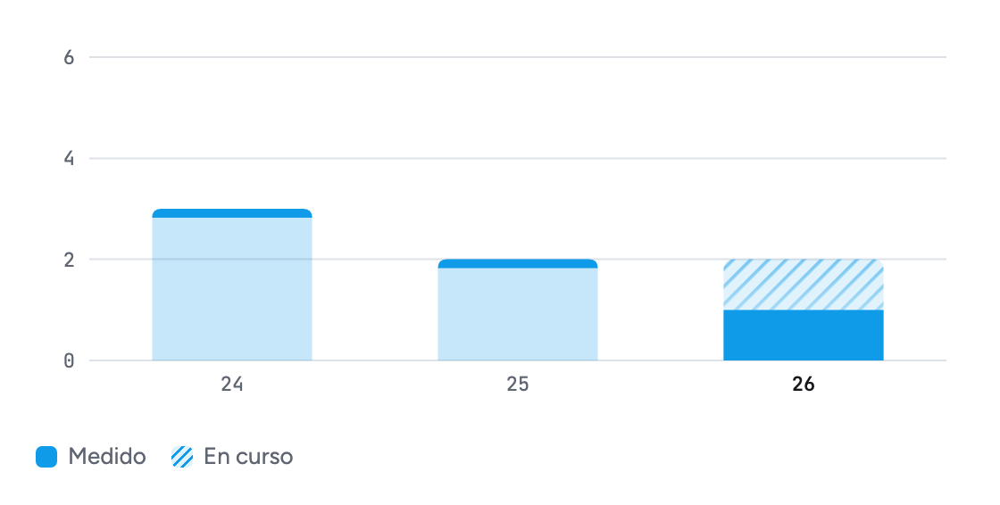
</picture>

```js
columns({
  variant: 'stripped',
  unit: ['cold start', 'cold starts'],
  max: 6,
  yTicks: [0, 2, 4, 6],
  data: [
    { label: '24', value: 3 },
    { label: '25', value: 2 },
    { label: '26', value: 1, projected: 2 }
  ]
})
```

Una columna con `projected` es el período en curso: lo medido va sólido y la proyección, rayada.

| `variant` | Cómo se ve |
|---|---|
| `solid` | Color pleno. |
| `stripped` | Cuerpo tenue con una franja sólida arriba. |
| `gradient` | Se apaga hacia abajo. |
| `duotone` | Mitad tenue, mitad plena. |
| `hatched` | Rayada. |

<details>
<summary>Opciones</summary>

| Opción | Tipo | Default |
|---|---|---|
| `data` ★ | `[{ label, title, value, projected }]` | |
| `max` ★ | number | |
| `variant` | ver arriba | `'solid'` |
| `yTicks` | number[] | `[0, max]` |
| `unit` | `[singular, plural]` | |
| `gaps` | `'hatched'` \| `'empty'` | `'hatched'` |
| `hue` | tono | `'sky'` |
| `label` | string | |

</details>

<a id="stacked"></a>

### `stacked()` · barras apiladas

<picture>
  <source media="(prefers-color-scheme: dark)" srcset="docs/img/stacked-dark.png">
  <source media="(prefers-color-scheme: light)" srcset="docs/img/stacked-light.png">
  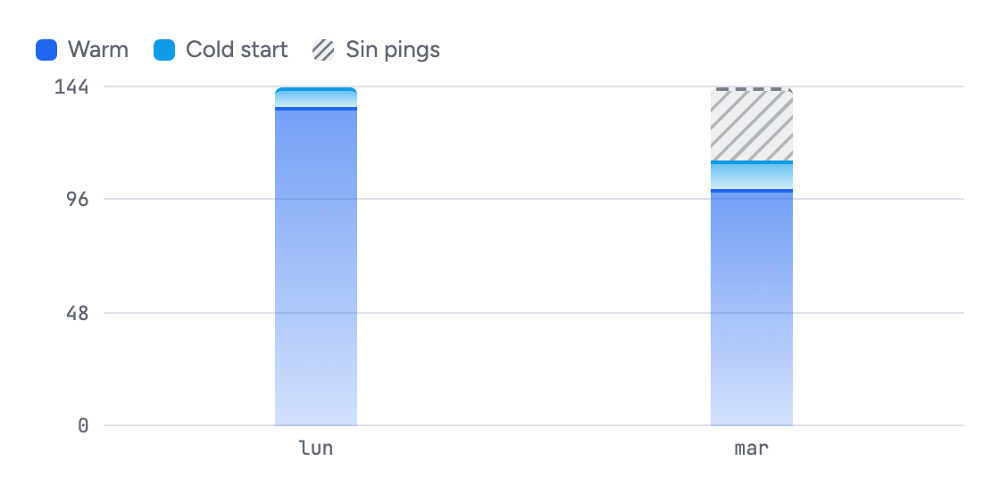
</picture>

```js
stacked({
  unit: ['ping', 'pings'],
  max: 144,
  yTicks: [0, 48, 96, 144],
  series: [
    { key: 'warm', label: 'Warm', hue: 'blue' },
    { key: 'cold', label: 'Cold start', hue: 'sky' },
    { key: 'none', label: 'Sin pings', hue: 'neutral', hatched: true }
  ],
  data: [
    { label: 'lun', values: { warm: 136, cold: 8 } },
    { label: 'mar', values: { warm: 101, cold: 12, none: 31 } }
  ]
})
```

| `variant` | Cómo se ve |
|---|---|
| `line` | Relleno translúcido con una línea del color de la serie arriba. |
| `solid` | Color pleno. |

<details>
<summary>Opciones</summary>

| Opción | Tipo | Default |
|---|---|---|
| `series` ★ | `[{ key, label, hue, hatched }]` | |
| `data` ★ | `[{ label, title, current, values }]` | `values` es `{ clave: número }`. |
| `max` ★ | number | |
| `variant` | `'line'` \| `'solid'` | `'line'` |
| `yTicks` | number[] | `[0, max]` |
| `height` | number | `190`, en píxeles. |
| `unit` | `[singular, plural]` | |
| `gaps` | `'hatched'` \| `'empty'` | `'hatched'` |
| `hidden` | string[] | Las series apagadas. |
| `label` | string | |

</details>

<a id="pie"></a>

### `pie()` · pie o donut

<picture>
  <source media="(prefers-color-scheme: dark)" srcset="docs/img/pie-dark.png">
  <source media="(prefers-color-scheme: light)" srcset="docs/img/pie-light.png">
  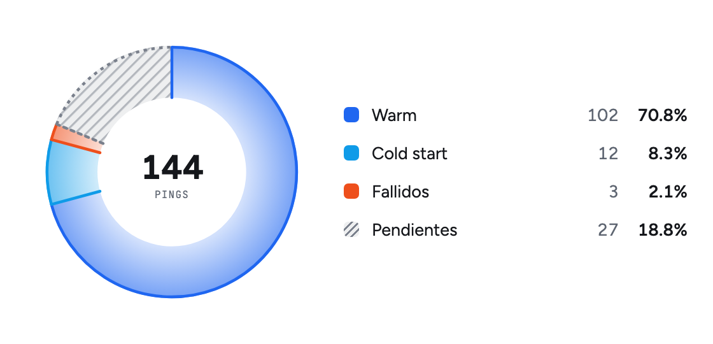
</picture>

```js
pie({
  variant: 'donut',
  unit: ['ping', 'pings'],
  center: { value: 144, label: 'pings' },
  slices: [
    { key: 'warm', label: 'Warm', value: 102, hue: 'blue' },
    { key: 'cold', label: 'Cold start', value: 12, hue: 'sky' },
    { key: 'failed', label: 'Fallidos', value: 3, hue: 'orange' },
    { key: 'none', label: 'Pendientes', value: 27, hue: 'neutral', hatched: true }
  ]
})
```

Al apagar una porción desde la leyenda, el círculo se vuelve a repartir entre las que quedan.

<details>
<summary>Opciones</summary>

| Opción | Tipo | Default |
|---|---|---|
| `slices` ★ | `[{ key, label, value, hue, hatched }]` | |
| `variant` | `'pie'` \| `'donut'` | `'pie'` |
| `fill` | `'line'` \| `'solid'` | `'line'` |
| `center` | `{ value, label }` | Sólo en `donut`. |
| `unit` | `[singular, plural]` | |
| `hidden` | string[] | Las porciones apagadas. |
| `label` | string | |

</details>

<a id="heatmap"></a>

### `heatmap()` · mapa de calor

<picture>
  <source media="(prefers-color-scheme: dark)" srcset="docs/img/heatmap-dark.png">
  <source media="(prefers-color-scheme: light)" srcset="docs/img/heatmap-light.png">
  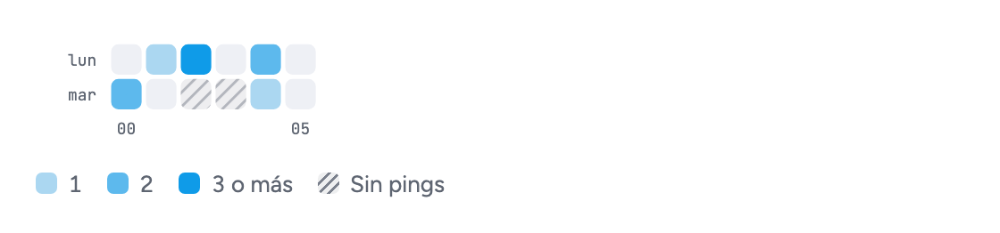
</picture>

```js
heatmap({
  rows: ['lun', 'mar', 'mié', 'jue', 'vie'],
  values: [
    [0, 1, 0, 0, 2, 0, 1, 3, 0, 0, 1, 0],
    [0, 0, 1, 0, 0, 1, 0, 2, 1, 0, 0, 0],
    [1, 0, 0, 'En pausa', 'En pausa', 'En pausa', 0, 1, 0, 2, 0, 0],
    [0, 2, 0, 0, 1, 0, 0, 3, 2, 0, 1, 0],
    [0, 0, 1, 0, 0, 0, 1, 0, 0, 1, 0, 0]
  ],
  unit: ['cold start', 'cold starts'],
  emptyLabel: 'Sin pings',
  colTicks: [0, 6, 11]
})
```

**Un texto en lugar de un número es una celda sin datos, y el texto dice por qué.** Va rayada, y
el tooltip muestra el motivo.

<details>
<summary>Opciones</summary>

| Opción | Tipo | Default |
|---|---|---|
| `rows` ★ | string[] | |
| `values` ★ | `(number \| string)[][]` | Una lista por fila. |
| `steps` | number | `3`. Cuántos niveles de color. |
| `unit` | `[singular, plural]` | |
| `emptyLabel` | string | `'Sin datos'` |
| `colTicks` | number[] | Qué columnas llevan rótulo. |
| `hue` | tono | `'sky'` |
| `label` | string | |

</details>

<a id="range"></a>

### `range()` · de un valor a otro, por fila

<picture>
  <source media="(prefers-color-scheme: dark)" srcset="docs/img/range-dark.png">
  <source media="(prefers-color-scheme: light)" srcset="docs/img/range-light.png">
  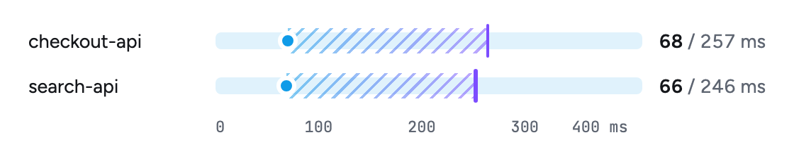
</picture>

```js
range({
  unit: 'ms',
  max: 400,
  ticks: [0, 100, 200, 300, 400],
  rows: [
    { label: 'checkout-api', from: 68, to: 257 },
    { label: 'search-api', from: 66, to: 246 }
  ]
})
```

<details>
<summary>Opciones</summary>

| Opción | Tipo | Default |
|---|---|---|
| `rows` ★ | `[{ label, from, to }]` | |
| `max` ★ | number | |
| `min` | number | `0`. La escala va de `min` a `max`. |
| `ticks` | number[] | `[min, max]` |
| `unit` | string | |
| `hue`, `hue2` | tono | `'sky'`, `'violet'` |

</details>

<a id="diverging"></a>

### `diverging()` · desde un cero al medio

<picture>
  <source media="(prefers-color-scheme: dark)" srcset="docs/img/diverging-dark.png">
  <source media="(prefers-color-scheme: light)" srcset="docs/img/diverging-light.png">
  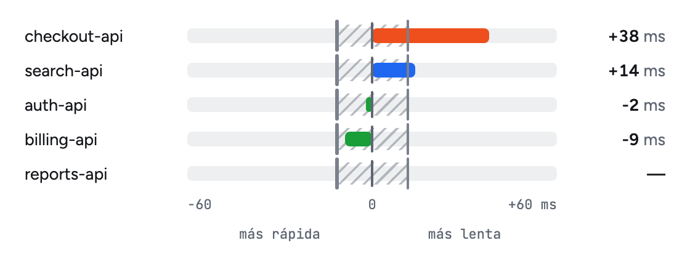
</picture>

```js
diverging({
  unit: 'ms',
  max: 60,
  sides: ['más rápida', 'más lenta'],
  reference: [-12, 12],
  rows: [
    { key: 'checkout', label: 'checkout-api', value: 38, hue: 'orange' },
    { key: 'search', label: 'search-api', value: 14 },
    { key: 'auth', label: 'auth-api', value: -2 },
    { key: 'billing', label: 'billing-api', value: -9 },
    { key: 'reports', label: 'reports-api', value: null }
  ]
})
```

Cuánto se aparta cada fila de un centro, hacia un lado o hacia el otro. La escala es simétrica: una
barra de +30 mide lo mismo que una de -30. El valor se escribe con signo.

<details>
<summary>Opciones</summary>

| Opción | Tipo | Default |
|---|---|---|
| `rows` ★ | `[{ key, label, value, hue }]` | |
| `max` ★ | number | La escala va de `-max` a `+max`. |
| `reference` | `[desde, hasta]` | La banda rayada: lo normal. |
| `sides` | `[izquierda, derecha]` | El rótulo de cada mitad. |
| `hue`, `negativeHue` | tono | `'blue'` para positivo, `'green'` para negativo. |
| `unit` | string | |

</details>

<a id="estados"></a>

## Estados

<picture>
  <source media="(prefers-color-scheme: dark)" srcset="docs/img/state-dark.png">
  <source media="(prefers-color-scheme: light)" srcset="docs/img/state-light.png">
  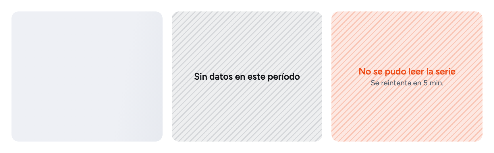
</picture>

| Estado | Cómo se pide |
|---|---|
| Cargando | La clase `sc-loading` en cualquier elemento que contenga al gráfico. |
| Vacío | `state({ kind: 'empty', title: 'Sin datos en este período' })` |
| Error | `state({ kind: 'error', title: 'No se pudo leer la serie', detail: 'Se reintenta en 5 min.' })` |

### Un gráfico nunca tira abajo la página

Ninguna función lanza un error y ninguna dibuja un gráfico roto.

| Lo que recibe | Lo que devuelve |
|---|---|
| Una lista vacía | El estado vacío. |
| Un solo punto, todo en cero, un máximo en cero | Un gráfico con sentido. |
| Una opción con un valor inválido | El gráfico, con el valor por defecto. |
| Le falta una opción obligatoria | El estado de error, en el lugar del gráfico, con un mensaje que dice qué falta. |

El error dibujado lleva `data-sc-error="<función>"`, para detectarlo desde un test o un monitoreo.

Un valor que se pasa de la escala, como un pico de 3 000 ms con `max: 400`, se **recorta contra el
área del gráfico**: no se aplasta a `max`, que lo haría pasar por un valor que vale exactamente eso.
El elemento lleva `data-sc-over` y el tooltip muestra el valor real.

<a id="datos-que-faltan"></a>

### Un dato que falta no es un cero

`null`, `undefined`, un texto que no es número o una lista más corta que las demás: todo eso es
un dato que no se midió. **No se dibuja como un cero.**

<picture>
  <source media="(prefers-color-scheme: dark)" srcset="docs/img/gaps-dark.png">
  <source media="(prefers-color-scheme: light)" srcset="docs/img/gaps-light.png">
  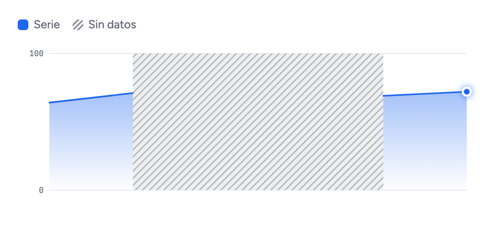
</picture>

```js
line({ values: [64, 71, null, null, 69, 72], max: 100 })
```

| Gráfico | Con un dato que falta |
|---|---|
| `line`, `stackedLine` | La línea se corta. |
| `columns`, `stacked` | Esa columna no se dibuja como medida: va rayada, o vacía con `gaps: 'empty'`. |
| `pie`, `segmented` | Esa porción no entra al reparto. |
| `bullet`, `rings`, `range` | Dibuja la escala, sin valor. |

Con `gaps: 'hatched'`, que es el default, el hueco lleva una banda rayada neutra y la leyenda
suma «Sin datos». Con `gaps: 'empty'` queda vacío.

## Tema

Los colores son variables CSS. Para usar los de tu proyecto, las redefinís:

```css
:root {
  --sc-blue: #0055ff;
  --sc-surface: #ffffff;
}
```

| Variable | Qué es |
|---|---|
| `--sc-blue`, `--sc-sky`, `--sc-violet`, `--sc-indigo` | Series. |
| `--sc-green`, `--sc-amber`, `--sc-orange` | Estado: en objetivo, aviso y fallo. |
| `--sc-neutral` | Sin datos. |
| `--sc-surface`, `--sc-inset`, `--sc-line` | Superficie, fondo hundido y líneas. |
| `--sc-text`, `--sc-muted`, `--sc-faint` | Texto. |
| `--sc-font`, `--sc-mono` | Tipografías. |

`hue` es el nombre de una variable, no un color. Para sumar un tono propio, lo definís y lo
nombrás:

```css
:root { --sc-marca: #ff0080; }
```

```js
bullet({ label: 'Ventas', value: 72, max: 100, reference: [60, 100], hue: 'marca' })
```

**Dark y light.** Sigue al sistema. Para fijar uno, `data-theme="dark"` o `data-theme="light"` en
`<html>`.

**El rayado** se cambia con `setHatch()`:

```js
setHatch({ look: 'diag', density: 'fina', opacity: 'suave' })
```

| Opción | Valores |
|---|---|
| `look` | `ref`: diagonal, y vertical en los anillos · `diag` · `vert` |
| `density` | `fina` · `media` · `gruesa` |
| `opacity` | `suave` · `media` · `fuerte` |

## Interacción

Todo lo atiende `mount()`, con un solo juego de listeners para la página entera.

| Qué | Cómo |
|---|---|
| Tooltip | En todos los gráficos. |
| Hover | La serie bajo el cursor queda entera y las demás se atenúan. |
| Cursor | En `line`, `stackedLine` y `heatmap` sigue al puntero punto por punto. |
| Leyenda | Un click apaga o prende una serie. |
| Entrada animada | `play(el)` muestra el skeleton y después anima la entrada. |

Respeta `prefers-reduced-motion`.

## Desempeño

| Medida | Tope | Medido |
|---|---|---|
| Peso, JS y CSS con gzip | 18 KB | ver `bun run test` |
| Un gráfico: armar, insertar y acomodar | 1 ms | 0.2 ms |
| Un tablero de 55 gráficos | 8 ms | 5 ms |
| Una interacción, por evento | 1 ms | 0.7 ms |

Medido en una Apple M4 Max con Chrome. El peso lo vigila un test; los tiempos, `bun run bench`.

`render()` no vuelve a pintar lo que no cambió. En un tablero que se refresca cada pocos
segundos, eso baja el costo de 5 ms a menos de 1.

Para que eso pase con un gráfico en SVG (`line`, `stackedLine`, `ribbon`, `columns`, `pie`,
`heatmap`, `rings`), pasale un **`id`** propio: sin él, los ids internos del SVG salen de un
contador y cada llamada devuelve un HTML distinto, así que `render()` repinta siempre y se
pierden el hover y las leyendas apagadas. Con `id`, las mismas opciones dan el mismo HTML.

```js
render(el, line({ id: 'ttfb-checkout', values, max: 400 }))
```

Dos gráficos de la misma página necesitan ids distintos. `id` acepta letras, números, `-` y `_`.

## Navegadores

Chrome 111, Safari 16.2 y Firefox 113, o más nuevos. Usa `color-mix()`, container queries y
máscaras CSS, sin alternativa para navegadores anteriores.

## Desarrollo

```sh
bun install
bun run test            # funciones puras
bun run test:browser    # runtime, en Chrome real
bun run lint
bun run build           # dist/
bun run bench           # tiempos
```

La demo está en `demo/index.html` y consume `src/` directo: serví el repo y abrí `/demo/`.

### Cómo está probada

| Prueba | Qué garantiza |
|---|---|
| Salidas canónicas | Cada gráfico devuelve, byte por byte, el HTML aprobado. |
| Recorrido de opciones | Cada opción de cada gráfico se reemplaza por un valor hostil. Ninguna puede inyectar HTML ni hacer fallar a la función. |
| Datos de borde | Vacío, un elemento, ceros, negativos, huecos y valores enormes. |
| Runtime en Chrome | Tooltip, hover, leyendas y cursor, con el mouse de verdad. |
| Presupuesto | El peso y la cantidad de nodos de cada gráfico no pueden crecer sin aviso. |
| Reversión | Cada test importante se comprueba rompiendo el código a propósito: tiene que dar rojo. |

## Lo que viene

- `setTheme()` y un tema por contenedor, no sólo por página.
- `setHatch()` con los valores en inglés, y el rayado configurable desde CSS.
- `locale`, para cambiar el idioma de los textos.
- `max` y marcas de eje calculados de los datos.
- `heatmap()` y `ribbon()` con cualquier unidad de tiempo.

## Créditos

El lenguaje visual sale de las aplicaciones de salud de los relojes: números grandes, extremos
redondeados y rayado para lo que no se midió. El rayado por máscara, el buffer y las variantes de
columna son ideas de [EvilCharts](https://evilcharts.com), rehechas sin React.

## Licencia

[MIT](LICENSE).
